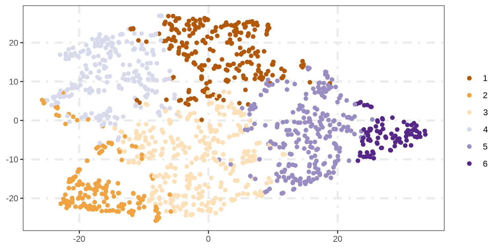
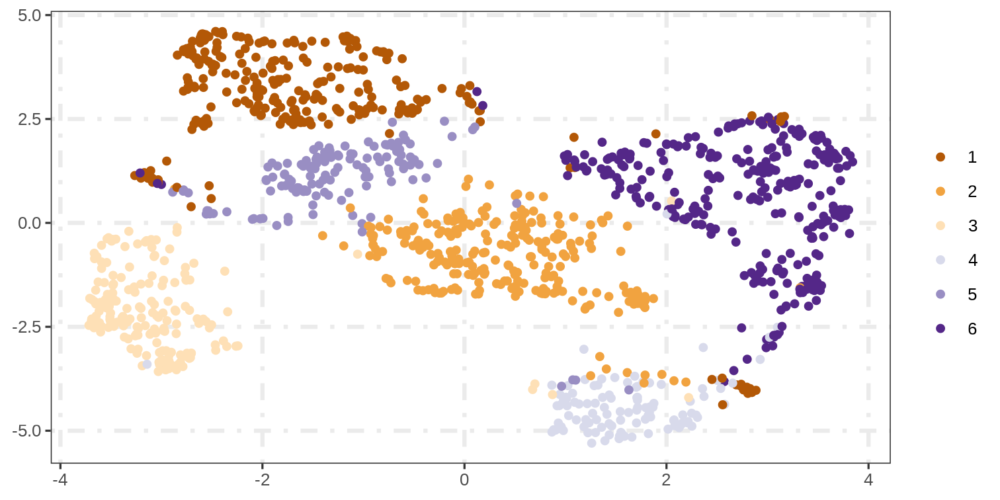

class: title-slide, left, top 
background-image: url(https://source.unsplash.com/Du41jIaI5Ww)
background-position: bottom left
background-size: cover


.pull-left[
  
  # `r rmarkdown::metadata$title`
  ## `r rmarkdown::metadata$subtitle`
  
  ### `r rmarkdown::metadata$author`
  ### `r rmarkdown::metadata$institute`
  
  ### `r rmarkdown::metadata$date`
]


```{r xaringan-themer, include=FALSE, warning=FALSE}
library(xaringanthemer)
style_duo_accent(primary_color = "#0b5394", secondary_color = "#9fc5e8", title_slide_text_color = "#0b5394", background_color = "#FFFFFF", colors = c(
    green = "#31b09e",
    "green-dark" = "#2c8475",
    highlight = "#87f9bb",
    purple = "#887ba3",
    pink = "#B56B6F",
    orange = "#f79334",
    red = "#dc322f",
    `blue-dark` = "#002b36",
    `text-dark` = "#202020",
    `text-darkish` = "#424242",
    `text-mild` = "#606060",
    `text-light` = "#9a9a9a",
    `text-lightest` = "#eaeaea"
  ),)
```

```{r, eval=FALSE, include=FALSE}
# install.packages("xaringan")
# install.packages("devtools")
# devtools::install_github("gadenbuie/xaringanExtra")
# install.packages("xaringanthemer")
# install.packages("showtext")
# install.packages("remotes")
# remotes::install_github("mitchelloharawild/icons")
# devtools::install_github("hadley/emo")
# devtools::install_github('emitanaka/anicon')
# install.packages("treeClust")
# install.packages("factoextra")
```

```{r setup, include=FALSE}
knitr::opts_chunk$set(fig.path="figures/", echo=FALSE, warning=FALSE, message=FALSE, fig.retina=3, fig.asp=.5, out.width='100%', fig.showtext = TRUE, comment = NULL)

# for fonts
library(showtext)
library(xaringanExtra)
# library(icons)
library(anicon)
# xaringanExtra::use_panelset()
```


```{css echo=FALSE}
.highlight-last-item > ul > li, 
.highlight-last-item > ol > li {
  opacity: 0.5;
}
.highlight-last-item > ul > li:last-of-type,
.highlight-last-item > ol > li:last-of-type {
  opacity: 1;
}
```

```{css eval=FALSE}
.bold-last-item > ul > li:last-of-type,
.bold-last-item > ol > li:last-of-type {
  font-weight: bold;
}
```

<style>
.left-column {
  color: #777;
  width: 30%;
  height: 92%;
  float: left;
  font-size: 18px;
}

.left-column h2:last-of-type, .left-column h3:last-child {
  color: #000;
}

.left-column1 {
  color: #777;
  width: 34%;
  height: 92%;
  float: left;
  font-size: 18px;
}

.right-column {
  width: 67%;
  float: right;
  padding-top: 0em;
}

.right-column1 {
  width: 63%;
  float: right;
  padding-top: 0em;
}
</style>


```{r xaringan-logo, echo=FALSE}
xaringanExtra::use_logo(
  image_url = "https://medarbetarportalen.gu.se/digitalAssets/1479/1479236_logucen1r.jpg",
  position = xaringanExtra::css_position(top = "1em", right = "1.7em"), exclude_class = c("inverse", "hide_logo"), width = "170", height = "200"
)
```

```{r xaringanExtra, echo=FALSE}
xaringanExtra::use_xaringan_extra(c("panelset", "scribble","tile_view","clipboard"))
```


```{r xaringan-extra-styles}
xaringanExtra::use_extra_styles(
  hover_code_line = TRUE,         #<<
  mute_unhighlighted_code = TRUE  #<<
)
```

```{r progressBar, echo = FALSE}
xaringanExtra::use_progress_bar(color = "#0051BA", location = "top")
```


```{r libraries, include=FALSE, warning=FALSE, message=FALSE}
library(tidyverse)
library(treeClust)
library(factoextra)
library(Rtsne)
library(ggplot2)
library(umap)
library(NbClust)
library(umap)
```

```{r, code = readLines("functions.R")}
```


<style>
.larger {
font-size: 1.2em
}
</style>


---
class: toc

## table of contents

---
class: bold-last-item, highlight-last-item, hide_logo, left
background-image: url(http://scikit-learn.sourceforge.net/0.6/_images/plot_mean_shift.png)
background-position: right
background-size: 60%

## **Clustering Challenges**

.left-column[

- One of the main issues in .blue[**clustering**] is the choice of .blue[**distance**]. 
{{content}}

]

--

- Usually, a distance function is chosen a **priori** before starting the clustering assignment.
{{content}}

--


- For instance, the **euclidean** distance is a very famous choice.
{{content}}


---
class: hide_logo
background-image: url(https://scikit-learn.org/stable/_images/sphx_glr_plot_cluster_comparison_001.png)
background-size: contain
background-position: middle 

---
class: bold-last-item, highlight-last-item, hide_lego

## A good distance function `r anicon::faa("trophy", animate="tada", speed="fast")`

--

- .large[Incorporate **categorical** variables. ]

--

- .large[Impose appropriate attribute **weights** (in particular, be insensitive to linear scaling of the attributes)]

--

- .large[Handle **missing** values and outliers gracefully. ]

--

- .large[Deals with the curse of **dimensionality**.]

???

Distance between the data points and the origin of the coordinate system grows as a square root of the number of dimensions

--

- .large[**Buttrey and Whitaker (2015)** .content-box-blue[ described an approach that uses a set of classification and **regression trees** that collectively determine dissimilarities that seems to perform well in both numeric and mixed data, particularly in the presence of noise.]]

--

- .large[In essence, we are **learning** the right distance function for this data set.]

---
class: section, middle, center, inverse, hide_lego

.f3[
## Small, simple, shallow intoduction
***
]

--


## Decision Trees

---
name: DT_1
background-image: url(figures/DT_1.png)
background-size: contain
background-position: middle 

---
name: DT_2
background-image: url(figures/DT_2.png)
background-size: contain
background-position: middle 

---
name: DT_3
background-image: url(figures/DT_3.png)
background-size: contain
background-position: middle 

---
name: DT_4
background-image: url(figures/DT_4.png)
background-size: contain
background-position: middle 

---
name: DT_5
background-image: url(figures/DT_5.png)
background-size: contain
background-position: middle 


---
class: bold-last-item, highlight-last-item, hide_lego

## Clustering using a tree-based approach

- .large[In a clustering problem, there is no **response** variable.]

--

- .large[We construct a tree for **each** variable in turn, using it as the **response** and all others are potential predictors. ]

--

- .large[The **surviving** set of trees are used to define related measures of **dissimilarity**. ]

--

- .large[.content-box-blue[The distance between any two participants was calculated using a tree-based clustering algorithm that addresses multi-collinearity among variables.] ]

--

- .large[This dissimilarity matrix can be **fed** to any clustering algorithms.]

---
class: bold-last-item, highlight-last-item, hide_lego


## Clustering using a tree-based approach 

--

.blockquote[
### 
- In the simplest, the dissimilarity between two observations i and j, say, $d(i, j)$, is given by the proportion of trees in which those two observations land in different leaves. 
]


--
.blockquote[
### 
- That is, the dissimilarity between observations associated with a particular tree t is $d_t (i, j) = 0$ or 1, depending on whether i and j do, or do not, fall into the same leaf under tree t. ]

--

.blockquote[
### 
- Then over a set of T trees, $d(i, j) = ∑_t d_t (i, j)/T$. ]


---
```{r dataPreprocssing, include=FALSE, warning=FALSE, message=FALSE}
mydata <- read.csv('/home/rstudio/AirwayClusteringPresentation/AirwayClusteringR/Original_Data/AirwayDiseasePhenotypingDataSets5/WSAS_AndOLIN_AirwayDiseasePhenotyping.csv')
Airway2 <- Get_Binary_data(mydata)
```


```{r kmeansOriginal, echo=FALSE, cache=TRUE}
set.seed(10)
# kmean on the original data
k_original_6 <- kmeans(Airway2, centers = 6, nstart = 25)
grp_k_original_6 <- k_original_6$cluster
```


```{r TsneOriginal, echo=FALSE, cache=TRUE, include=FALSE}
set.seed(10)
# Tsne for tree new data
tsne_airway_2 <- Rtsne(X = Airway2, is_distance = FALSE, check_duplicates = FALSE)

tsne_airway_2 <- tsne_airway_2$Y %>%
  data.frame() %>%
  setNames(c("X", "Y"))
tsne_airway_2$cl <- factor(grp_k_original_6)
# plot
# tsnePlot <- ggplot(tsne_airway_2, aes(x=X, y=Y, color=cl)) + geom_point() + my_theme + scale_color_brewer(palette = "BuPu")

ggplot(tsne_airway_2, aes(x=X, y=Y, color=cl)) + geom_point() + my_theme + scale_color_brewer(palette = "PuOr")
```


class: section, middle, center, inverse, hide_lego


.f3[
## Clustering with Kmeans on the original data
***
]

--

## using the euclidian distance

---





]
]


---
class: section, middle, center, inverse

.f3[
# Decesion tree distance and hierarchical clustering
***
]

--

## Use decision tree to learn the right distance matrix 

---
class: hide_logo
exclude: true
```{r Treedist, echo=FALSE}
# important to set a seed here
set.seed(33)
airway.tc1 <- treeClust(Airway2, d.num = 1, control = treeClust.control(return.trees = TRUE, return.dists = TRUE))
# hierarchical clustering with ward distance
h_tree <- hcut(airway.tc1$dists, 6, isdiss = TRUE, hc_method = 'ward.D2')
```

```r
# important to set a seed here
set.seed(33)
airway.tc1 <- treeClust(Airway2, d.num = 1, control = treeClust.control(return.trees = TRUE, return.dists = TRUE))
# hierarchical clustering with ward distance
h_tree <- hcut(airway.tc1$dists, 6, isdiss = TRUE, hc_method = 'ward.D2')
```

---
## find the optimal number of clusters

```{r OptClust, warning=FALSE, message=FALSE, cache=TRUE, include=FALSE}
# 5 clusters is what mostly reported
Nb_converted_DT <- NbClust(data = Airway2, diss = airway.tc1$dists,distance = NULL, min.nc = 4,
max.nc = 10, method = 'ward.D2')
```

```{r OptClust_2, fig.show="hide", include=FALSE, message=FALSE, warning=FALSE, cache=TRUE}
# fviz_nbclust(Nb_converted_DT[3])
```

`)


---
name: UmapPlot
```{r, include=FALSE}
tree_d1_newdata_airway <- tcnewdata(airway.tc1, d.num = 1)
k_tree_6 <- kmeans(tree_d1_newdata_airway, centers = 6, nstart = 25)
grp_k_tree_6 <- k_tree_6$cluster
```


```{r, include=FALSE}
tree_umap <- umap(tree_d1_newdata_airway)

tree_umap_df <- tree_umap$layout %>%
  data.frame() %>%
  setNames(c("X", "Y"))

tree_umap_df$cl_k <- factor(k_tree_6$cluster)
# plotting the umap

```


```{r umap_plot, include=FALSE}
# BuPu
ggplot(tree_umap_df, aes(x=X, y=Y, color=cl_k)) + geom_point() + my_theme + scale_color_brewer(palette = "PuOr")
```



---
class: section, middle, center, inverse

.f3[
# Validating the clustering results
***
]

--

## Useing random forest 

---
background-image: url(DT_clustering_2.png)
background-size: contain
background-position: middle

---
## Cluster describtions

- cluster 1 Smoking-associted cluster
- cluster 2 Older healthy adults
- cluster 3 Sputum cluster
- cluster 4 Wheezing adults
- cluster 5 Healthy young adults
- cluster 6 Symptomatic females


---
## Shiny app was developed for visulizing the clusters

[Shinyapp Link](https://rani-shiny.shinyapps.io/visualise_airway_clustering/#section-histogram-and-box-plots)


